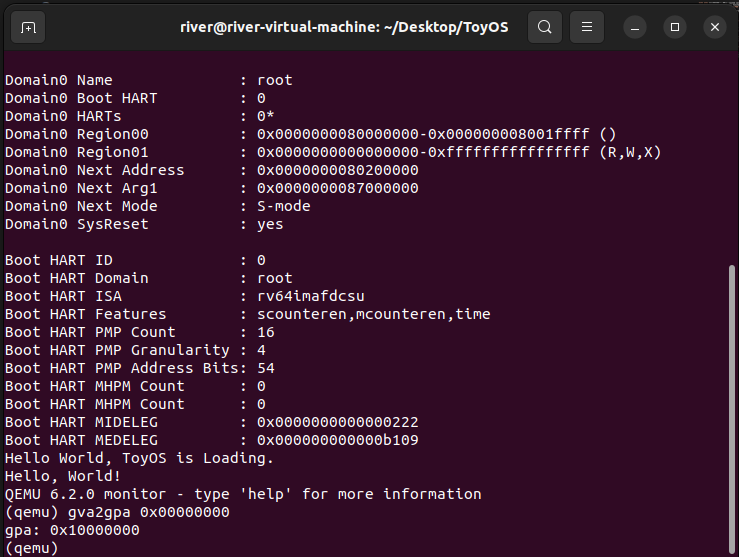

## lab3 验证虚拟地址物理地址映射

写完了地址映射的代码，我们便需要想办法进行验证，最容易想到的是将页表项PTE打印出来，直接查看某个虚拟地址（VA）对应的物理地址（PA）。但PTE中并非所有内容都是我们所需的，肉眼读64bit，并认出地址是哪一部分还是有点难度。因此我们采用另一种方式，借助`gva2gpa <VA>`命令。

### 准备
我们在vm.c中的kvmmake中在实现地址映射功能的基础上，多加了一行“无效”代码,如下：

```c
kvmmap(kpgtbl, 0, 0x10000000L, PGSIZE, PTE_R | PTE_W);
```

这行代码的功能是为了将将物理地址`0x00000000`映射到虚拟地址`0x10000000`。

### 验证

`make qemu`后，待终端中出现通过system call输出`Hello, World!`后，先按ctrl+a,再按c，便可进入qemu moniter，输入`gva2gpa 0x00000000`如果，得到的结果为`0x10000000`（如下图），则说明我们的地址映射已经成功启用。反之则失败。
> 温馨提示，记得检查是否将内核页表地址写入SATP寄存器以及刷新TLB。


### 解释

为什么要这样映射（或者说为什么要映射`0x00000000`），我们先观察一下其余的`kvmmap`调用，例如：
```c
kvmmap(kpgtbl, UART0, UART0, PGSIZE, PTE_R | PTE_W);
```
我们会发现这一块地址映射中VA等于PA，这会有什么不方便的地方呢？

答：我们在qemu监视器中可以使用`gva2gpa <VA>`命令来查看VA对应的PA。这个命令有个“特性”是，未启用SATP寄存器（及未启用地址映射）时，通过`gva2gpa指令`查看到的PA是与VA相同的。也就导致无论我们是否启用地址映射，得到的结果都是相同的。

所以我们才想到将`0x00000000`映射到`0x10000000`，使得PA!=VA，这样我们才更好验证地址映射是否真正地启用。

再者，我们考虑到在内核地址空间中，低地址部分`0x00000000`开始的一部分区域是未使用的。所以我们也没有那么担心这一操作（在页表中添加`0x00000000`～`0x00000000+PGSIZE`这一块区域的映射）会增加什么问题。